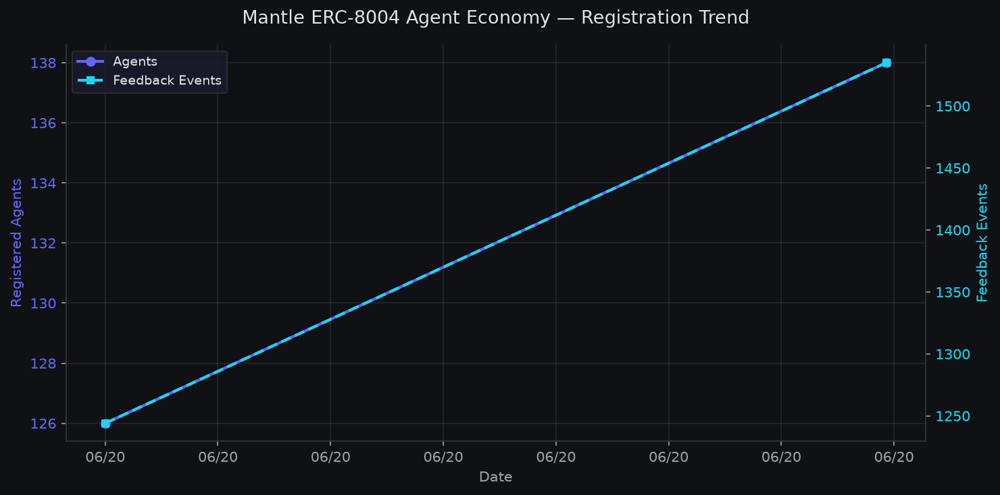

# Mantle Agent Pulse — ERC-8004 Adoption Report

*Generated: 2026-06-20 23:15 UTC*

## Latest Mantle Mainnet Snapshot

| Metric | Value |
|--------|-------|
| Timestamp | 2026-06-20T23:13:58.913191Z |
| Registered Agents | 138 |
| Feedback Events | 1535 |
| Validations | Coming Soon |
| Last Indexed Block | 96933446 |
| Chain Head Block | 96933463 |
| Identity Registry Deployed | True |
| Reputation Registry Deployed | True |

## Registration Trend Over Time

| Date | Agents | Feedback | Last Indexed Block |
|------|--------|----------|--------------------|
| 2026-06-20 | 126 | 1244 | 96593016 |
| 2026-06-20 | 138 | 1535 | 96933446 |

## Peer Chain Comparison (ERC-8004 Explorer)

*Data from: 2026-06-20*

| Chain | Agents | Feedback |
|-------|--------|----------|
| BNB Chain Mainnet | 139553 | 29490 |
| Base Mainnet | 55938 | 265735 |
| Ethereum Mainnet | 35245 | 3180 |
| Celo Mainnet | 9502 | 23474 |
| Monad Mainnet | 8766 | 9101 |
| Gnosis Mainnet | 3759 | 4341 |
| Avalanche C-Chain | 1770 | 14374 |
| Arbitrum One | 1125 | 107 |
| Abstract Mainnet | 1067 | 292 |
| Polygon Mainnet | 556 | 193 |
| OP Mainnet | 516 | 30 |
| Mantle Mainnet | 138 | 1535 |
| Linea Mainnet | 115 | 31 |
| Scroll Mainnet | 108 | 0 |
| Soneium Mainnet | 0 | 0 |

## Agent Density Index (ADI) — Cross-Chain Comparison

**Formula:** `ADI = (registered_agents / chain_TVL_USD) × 1,000,000`

ADI measures registered agents per $1M of chain TVL, normalizing for chain size to enable fair cross-chain comparison.

| Chain | Agents | TVL ($) | ADI (agents/$1M) |
|-------|--------|---------|------------------|
| Celo Mainnet | 9502 | $19,722,064 | 481.7954 |
| BNB Chain Mainnet | 139553 | $5,128,398,432 | 27.2118 |
| Base Mainnet | 55938 | $4,214,018,699 | 13.2743 |
| Avalanche C-Chain | 1770 | $474,862,704 | 3.7274 |
| Mantle Mainnet | 138 | $145,367,363 | 0.9493 |
| Ethereum Mainnet | 35245 | $38,981,084,755 | 0.9042 |

## Methodology

### Data Collection
- **Agent/feedback counts**: Scraped from the [ERC-8004 Explorer](https://erc-8004.quicknode.com) public web UI (not the paywalled REST API)
- **TVL data**: [DefiLlama](https://defillama.com) free API (`api.llama.fi/v2/chains`)
- **On-chain verification** (`--full-verify`): Direct `eth_getLogs` scan of Transfer events from the zero address on the IdentityRegistry contract

### Key Assumptions & Limitations
- The ERC-8004 indexer may be mid-backfill at any given time; a single snapshot should not be treated as ground truth
- TVL is a point-in-time metric and can fluctuate significantly
- ADI does not account for agent quality, activity, or economic impact

---

*Report generated by [Mantle Agent Pulse](https://github.com/Zireaelst/Mantle-Agent-Pulse-Daily-Logger) — a research tool for the Mantle Research Challenge*